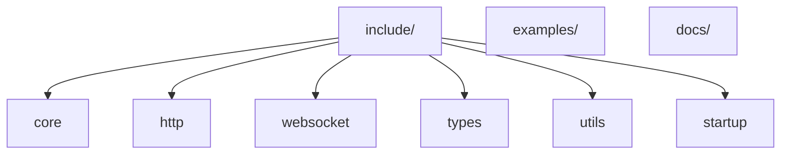

# AGENTS.md

## Overview

**kurlyk** is a header-only C++11/17 library built on top of **libcurl** and **Simple-WebSocket-Server** to provide convenient HTTP and WebSocket clients. It hides networking boilerplate and offers asynchronous execution, rate limiting, automatic reconnection, and proxy support. The `core::NetworkWorker` processes tasks in a background thread while modules such as `HttpClient` and `WebSocketClient` expose simple class-based APIs.

## Features

- Asynchronous HTTP requests and WebSocket messaging
- Optional background worker or synchronous processing
- Rate limiting and retry logic for both transports
- Automatic WebSocket reconnection with configurable attempts
- Proxy servers, custom headers and timeouts
- Centralized error dispatching through `NetworkWorker`
- Header-only design compatible with C++11 and later

## Use Cases

- REST/HTTP clients for small applications or bots
- WebSocket clients that send/receive messages with reconnection logic
- Lightweight utilities needing rate-limited network access
- Experiments and tools where manual networking boilerplate is undesirable

## Installation & Build

- Add `include/` to your compiler's include path and link against `libcurl`, `OpenSSL`, and either Boost.Asio or standalone Asio. WebSocket functionality additionally requires Simple-WebSocket-Server.
- Examples live in `examples/` and rely on libraries shipped in `libs/`; you may use system packages instead.
- To build `simple_http_request_example` with only HTTP enabled:

```bash
g++ examples/simple_http_request_example.cpp -Iinclude -std=c++17 \
    -pthread -lcurl -lssl -lcrypto -DKURLYK_WEBSOCKET_SUPPORT=0 -o simple_http_example
./simple_http_example
```

- Generate Doxygen documentation:

```bash
doxygen Doxyfile
```

## Configuration Macros

Define these macros before including `<kurlyk.hpp>` to tailor functionality. "0" means disabled, "1" enabled unless noted.

| Macro | Values | Default | Description |
|-------|--------|---------|-------------|
| `KURLYK_AUTO_INIT` | 0 / 1 | 1 | Automatically register managers during static initialization. |
| `KURLYK_AUTO_INIT_USE_ASYNC` | 0 / 1 | 1 | Run `NetworkWorker` in a background thread during auto-init. Ignored if `KURLYK_AUTO_INIT` = 0. |
| `KURLYK_HTTP_SUPPORT` | 0 / 1 | 1 | Include HTTP components such as `HttpClient`. |
| `KURLYK_WEBSOCKET_SUPPORT` | 0 / 1 | 1 | Include WebSocket components such as `WebSocketClient`. |
| `KURLYK_ENABLE_JSON` | 0 / 1 | 0 | Include nlohmann::json and expose JSON-aware types. |
| `KURLYK_USE_JSON` | defined / undefined | undefined | Enable enum ↔ JSON helpers in `type_utils.hpp`; usually set alongside `KURLYK_ENABLE_JSON`. |
| `KURLYK_USE_CURL` | defined / undefined | defined on non-Emscripten | Use libcurl for HTTP features. |
| `KURLYK_USE_SIMPLEWEB` | defined / undefined | defined on non-Emscripten | Use Simple-WebSocket-Server for WebSocket features. |
| `KURLYK_USE_EMSCRIPTEN` | defined / undefined | defined when compiling for Emscripten | Use Emscripten-specific WebSocket adapters instead of curl/SimpleWeb. |

## Core Components

| Component | Description |
|-----------|-------------|
| `core::NetworkWorker` | Singleton that processes HTTP and WebSocket tasks in a background thread. |
| `HttpClient` | Sends asynchronous HTTP requests with rate limits, proxy and retry support. |
| `WebSocketClient` | Manages WebSocket connections, event handlers and message sending. |
| `HttpRequestManager` / `WebSocketManager` | Internal managers coordinating requests and applying rate limits. |

## Testing and Build

There is no dedicated test suite. When modifying library headers, compile at least one example from `examples/` (e.g., `simple_http_request_example.cpp`) to ensure the code still builds.

## Code Style: Git Commit Convention

Follow the [Conventional Commits](https://www.conventionalcommits.org/) style:

- `feat:` new features
- `fix:` bug fixes
- `docs:` documentation changes
- `refactor:` code refactoring without behaviour changes
- `test:` when adding or modifying tests

Format: `type(scope): short description` where the scope is optional. Keep messages short and imperative.

## Code Style: Naming Conventions

### Variable naming

- Always use the `m_` prefix for class fields (e.g., `m_event_hub`, `m_task_manager`).
- Optional `p_` and `str_` prefixes may be used when a function or method has more than five variables or arguments of different types. Otherwise, omit these prefixes.
- Boolean variables start with `is`, `has`, `use`, `enable`, or for class fields, `m_is_`, `m_has_`, etc. (e.g., `is_connected`, `m_is_active`).
- Do not use the prefixes `b_`, `n_`, or `f_`.

### Doxygen comments

- All code comments and Doxygen annotations must be in English.
- Prepend functions and classes with `/// \\brief`.
- Do not start descriptions with `The`.

### File names

- Use `CamelCase` if the file contains only one class (e.g., `TradeManager.hpp`).
- Use `snake_case` if the file contains multiple classes, utilities, or helper structures (e.g., `trade_utils.hpp`, `market_event_listener.hpp`).

### Entity names

- Class, struct, and enum names use `CamelCase`.
- Method names use `snake_case`.

### Method naming

- Methods are named using `snake_case`.
- Getter methods may omit the `get_` prefix when they simply return a reference or value, expose an internal object, or behave like a property (e.g., `size()`, `empty()`).
- Use `get_` when the method performs computations or when omitting it would be misleading.

## System Map

- `include/` – public headers.
- `include/kurlyk/core` – core infrastructure with `NetworkWorker` and base interfaces.
- `include/kurlyk/http` – HTTP client and request management.
- `include/kurlyk/websocket` – WebSocket client and connection manager.
- `include/kurlyk/types` – shared types such as enums and proxy configs.
- `include/kurlyk/utils` – helper utilities and error categories.
- `include/kurlyk/startup` – optional auto-initialization helpers.
- `examples/` – usage examples built against bundled or system libs.
- `docs/` – generated and hand-written documentation.



## Architectural Patterns & Invariants

- Header-only design keeps all functionality in headers; no compiled library.
- `core::NetworkWorker` processes tasks on a single background thread; avoid blocking it.
- HTTP and WebSocket managers apply rate limits and retries consistently.
- Error dispatch flows through `NetworkWorker`; maintain exception safety.
- Public APIs rely on value semantics and RAII.
- Configuration is compile-time via macros with minimal defaults.
- Code remains portable across C++11/17 compilers and network stacks.

