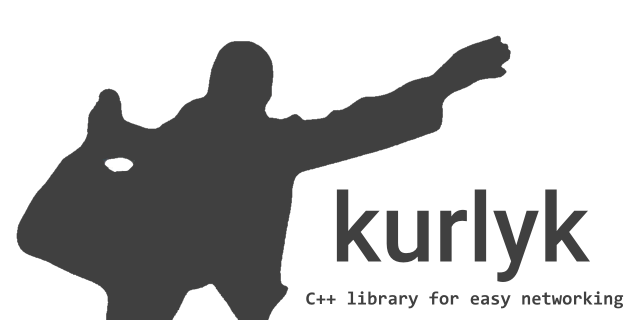
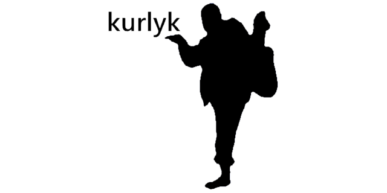

# kurlyk


**C++ library for easy networking**

[](LICENSE)


[Do you speak English?](README.md)

## Описание

**kurlyk** — это ещё одна библиотека, реализующая HTTP и WebSocket клиенты для C++. Построена как обертка над `curl` и `Simple-WebSocket-Server`, предоставляя упрощённый интерфейс для работы с HTTP и WebSocket в C++ приложениях. Она поддерживает асинхронное выполнение HTTP-запросов с ограничением скорости и повторными попытками, а также работу с WebSocket-соединениями.

Если вам не подошли другие библиотеки, такие как *easyhttp-cpp, curl_request, curlpp-async, curlwrapper, curl-Easy-cpp, curlpp11, easycurl, curl-cpp-wrapper…* возможно, стоит попробовать `kurlyk`.

### Особенности

- Асинхронное выполнение HTTP и WebSocket запросов
- Фоновый worker или синхронная обработка
- Поддержка ограничения скорости для предотвращения перегрузки сети
- Опциональная защита от неограниченного роста очередей через bounded admission/backpressure
- Автоматическое переподключение с настраиваемыми параметрами
- Прокси, пользовательские заголовки, cookie и таймауты
- Простота использования через интуитивно понятный интерфейс классов
- Ориентация на использование в небольших приложениях
- Поддержка C++11 и более новых toolchains

### CI-покрытие

| Платформа | Что проверяется |
|-----------|-----------------|
| Windows | Integration-сборки MinGW и MSVC с fallback-зависимостями, HTTP backpressure regression и локальным WebSocket integration coverage. |
| Windows extras | ODR-проверки singleton и auto-init заголовков. |
| Linux | C++11/C++17 header smoke test с отключенными HTTP/WebSocket. |
| macOS | C++11/C++17 header smoke test с отключенными HTTP/WebSocket. |

## Backpressure и переполнение очередей

Теперь в kurlyk есть два разных уровня управления потоком:

- rate limiting замедляет выпуск запросов и сообщений в сетевой backend;
- backpressure ограничивает объём работы, принимаемой в выбранные очереди.

Что именно ограничивается сейчас:

- HTTP использует глобальный лимит pending queue через `kurlyk::set_max_pending_requests(...)`;
- WebSocket использует per-client лимит очереди исходящих send/close через `WebSocketClient::set_max_send_queue_size(...)`;
- значение `0` означает unbounded queue.

Публичные admission helper'ы:

- `kurlyk::SubmitResult`
- `kurlyk::submit_http_request(...)`
- `IWebSocketSender::submit_message(...)`
- `IWebSocketSender::submit_close(...)`
- `WebSocketClient::submit_message(...)`
- `WebSocketClient::submit_close(...)`

Совместимость:

- старые `bool`-API сохранены как wrappers;
- HTTP future-overload при admission reject становится ready сразу и возвращает `HttpResponse` с `error_code`, а не бросает `runtime_error`;
- в этом проходе не ограничиваются очереди `NetworkWorker`, WebSocket FSM и накопленные event queues.

### Пример HTTP backpressure

```cpp
kurlyk::init(true);
kurlyk::set_max_pending_requests(64);

std::unique_ptr<kurlyk::HttpRequest> request(new kurlyk::HttpRequest());
request->request_id = kurlyk::generate_request_id();
request->method = "GET";
request->set_url("https://httpbin.org/get", kurlyk::QueryParams());

kurlyk::SubmitResult submit = kurlyk::submit_http_request(
    std::move(request),
    [](kurlyk::HttpResponsePtr response) {
        if (response && response->error_code) {
            std::cout << "HTTP runtime error: " << response->error_code.message() << std::endl;
        }
    });

if (!submit) {
    std::cout << "HTTP submit rejected: " << submit.error_code.message() << std::endl;
}
```

### Пример WebSocket backpressure

```cpp
kurlyk::WebSocketClient client("wss://echo-websocket.fly.dev/");
client.set_max_send_queue_size(32);

kurlyk::SubmitResult submit = client.submit_message(
    "Hello with admission check",
    0,
    [](const std::error_code& ec) {
        if (ec) {
            std::cout << "Send failed: " << ec.message() << std::endl;
        }
    });

if (!submit) {
    std::cout << "WebSocket submit rejected: " << submit.error_code.message() << std::endl;
}
```

## Примеры использования

Примеры находятся в папке `examples`. Ниже приведены основные примеры использования библиотеки.

Собрать все примеры из репозитория через CMake можно так:

```powershell
cmake -S . -B build-examples -DKURLYK_BUILD_EXAMPLES=ON
cmake --build build-examples --config Release
```

### Пример использования WebSocket клиента

Этот пример показывает, как подключиться к WebSocket серверу, отправить сообщение и обработать различные события (открытие соединения, получение сообщения, закрытие соединения и ошибки). Здесь используется автоинициализация C++17 по умолчанию; для C++11/14 задайте `KURLYK_AUTO_INIT=0` и вызовите `kurlyk::init()` / `kurlyk::deinit()` вручную.

```cpp
#include <kurlyk.hpp>
#include <thread>
#include <chrono>

int main() {
    // Создаём клиент WebSocket с указанным URL сервера
    kurlyk::WebSocketClient client("wss://echo-websocket.fly.dev/");

    // Настраиваем обработчик событий WebSocket
    client.on_event([](std::unique_ptr<kurlyk::WebSocketEventData> event) {
        switch (event->event_type) {
            case kurlyk::WebSocketEventType::WS_OPEN:
                KURLYK_PRINT << "Соединение установлено" << std::endl;

                KURLYK_PRINT << "HTTP версия: " << event->sender->get_http_version() << std::endl;
                KURLYK_PRINT << "Заголовки:" << std::endl;
                for (const auto& header : event->sender->get_headers()) {
                    KURLYK_PRINT << header.first << ": " << header.second << std::endl;
                }

                event->sender->send_message("Привет, WebSocket!", 0, [](const std::error_code& ec) {
                    if (ec) {
                        KURLYK_PRINT << "Ошибка отправки сообщения: " << ec.message() << std::endl;
                    } else {
                        KURLYK_PRINT << "Сообщение успешно отправлено" << std::endl;
                    }
                });
                break;

            case kurlyk::WebSocketEventType::WS_MESSAGE:
                KURLYK_PRINT << "Получено сообщение: " << event->message << std::endl;
                event->sender->send_message("Привет снова!");
                break;

            case kurlyk::WebSocketEventType::WS_CLOSE:
                KURLYK_PRINT << "Соединение закрыто: " << event->message
                             << "; Код статуса: " << event->status_code << std::endl;
                break;

            case kurlyk::WebSocketEventType::WS_ERROR:
                KURLYK_PRINT << "Ошибка: " << event->error_code.message() << std::endl;
                break;
        }
    });

    KURLYK_PRINT << "Подключение..." << std::endl;
    client.connect();

    std::this_thread::sleep_for(std::chrono::seconds(10));

    KURLYK_PRINT << "Отключение..." << std::endl;
    client.disconnect_and_wait();

    KURLYK_PRINT << "Конец работы" << std::endl;
    return 0;
}
```

### Примеры использования HTTP-клиента

Эти примеры показывают, как использовать HTTP-клиент библиотеки kurlyk для выполнения различных запросов и обработки ответов. В них отключена автоинициализация, потому что `kurlyk::init()` и `kurlyk::deinit()` вызываются вручную.

#### Поток выполнения HTTP callback'ов

HTTP callback'и выполняются на пути обработки `NetworkWorker`. В асинхронном
режиме это фоновый worker thread; в синхронном режиме это поток, который
вызывает `kurlyk::process()`. Держите callback'и короткими и при необходимости
передавайте тяжёлую работу в очереди или потоки приложения, потому что
блокирующий callback задерживает другую HTTP/WebSocket работу того же worker'а.

#### Общий helper для примеров

```cpp
#define KURLYK_AUTO_INIT 0
#include <kurlyk.hpp>
#include <iostream>

void print_response(const kurlyk::HttpResponsePtr& response) {
    if (!response) {
        KURLYK_PRINT << "response is null" << std::endl;
        return;
    }

    KURLYK_PRINT
        << "ready: " << std::boolalpha << response->ready << std::endl
        << "response: " << response->content << std::endl
        << "error_code: " << response->error_code.message() << std::endl
        << "status_code: " << response->status_code << std::endl
        << "----------------------------------------" << std::endl;
}
```

#### Пример 1: Выполнение GET и POST запросов с обработчиком ответов

```cpp
int main() {
    kurlyk::init(true);
    kurlyk::HttpClient client("https://httpbin.org");

    client.get("/ip", kurlyk::QueryParams(), kurlyk::Headers(),
        [](const kurlyk::HttpResponsePtr response) {
            print_response(response);
        });

    client.post("/post", kurlyk::QueryParams(), {{"Content-Type", "application/json"}},
        "{\"text\":\"Sample POST Content\"}",
        [](const kurlyk::HttpResponsePtr response) {
            print_response(response);
        });

    KURLYK_PRINT << "Press Enter to exit..." << std::endl;
    std::cin.get();
    kurlyk::deinit();
    return 0;
}
```

#### Пример 2: Выполнение GET и POST запросов с std::future

Если запрос отклоняется ещё до попадания в pending queue, future становится ready сразу и возвращает `HttpResponse` с `error_code = QueueLimitExceeded` или `ShuttingDown`.

```cpp
int main() {
    kurlyk::init(true);
    kurlyk::HttpClient client("https://httpbin.org");

    auto future_response = client.get("/get", kurlyk::QueryParams{{"param", "value"}}, kurlyk::Headers());
    print_response(future_response.get());

    auto future_post = client.post("/post", kurlyk::QueryParams(),
        kurlyk::Headers{{"Header", "Value"}}, "Async POST Content");
    print_response(future_post.get());

    kurlyk::deinit();
    return 0;
}
```

#### Пример 3: Настройка прокси и отправка GET запроса

```cpp
int main() {
    kurlyk::init(true);
    kurlyk::HttpClient client("https://httpbin.org");

    client.set_proxy("127.0.0.1", 8080, "username", "password", kurlyk::ProxyType::HTTP);

    client.get("/ip", kurlyk::QueryParams(), kurlyk::Headers(),
        [](const kurlyk::HttpResponsePtr response) {
            print_response(response);
        });

    KURLYK_PRINT << "Press Enter to exit..." << std::endl;
    std::cin.get();
    kurlyk::deinit();
    return 0;
}
```

#### Пример 4: GET запрос с callback overload `http_get`

```cpp
int main() {
    kurlyk::init(true);

    const uint64_t request_id = kurlyk::http_get(
        "https://httpbin.org/ip",
        kurlyk::QueryParams(),
        kurlyk::Headers(),
        [](const kurlyk::HttpResponsePtr response) {
            print_response(response);
        });

    KURLYK_PRINT << "Request id: " << request_id << std::endl;
    KURLYK_PRINT << "Press Enter to exit..." << std::endl;
    std::cin.get();

    kurlyk::cancel_request_by_id(request_id).wait();
    kurlyk::deinit();
    return 0;
}
```

#### Пример 5: GET запрос с future overload `http_get`

```cpp
int main() {
    kurlyk::init(true);

    auto result = kurlyk::http_get(
        "https://httpbin.org/ip",
        kurlyk::QueryParams(),
        kurlyk::Headers());

    KURLYK_PRINT << "Request id: " << result.first << std::endl;
    print_response(result.second.get());

    kurlyk::deinit();
    return 0;
}
```

#### Пример 6: Потоковая обработка чанков ответа

Когда streaming включён, callback вызывается для каждого полученного чанка тела
с `response->stream_chunk == true` и `response->ready == false`. Последний
callback остаётся обычным завершённым ответом с `ready == true`.
Используйте `stream_chunk` первым для классификации body chunk callback'ов.
Chunk callback не является маркером успеха; итоговый `ready`-ответ остаётся
авторитетным результатом передачи. `status_code` у chunk содержит текущий HTTP
статус, когда libcurl уже может его отдать, но это не маркер завершения.
Неготовые callback'и с `stream_chunk == false` зарезервированы для
промежуточных состояний, например неудачной попытки перед retry, и могут нести
`error_code`. Если был отдан хотя бы один streaming chunk, kurlyk не делает
автоматический retry этой передачи, потому что вызывающий код уже мог переслать
байты downstream-клиенту.

```cpp
int main() {
    kurlyk::init(true);

    kurlyk::http_post(
        "https://api.example.com/v1/chat/completions",
        kurlyk::QueryParams(),
        kurlyk::Headers{{"Content-Type", "application/json"}},
        R"({"stream":true})",
        true,
        [](kurlyk::HttpResponsePtr response) {
            if (!response) return;

            if (response->stream_chunk) {
                std::cout << response->content;
                return;
            }

            if (response->error_code) {
                std::cerr << response->error_code.message() << std::endl;
            }
        });

    std::cin.get();
    kurlyk::deinit();
    return 0;
}
```

#### Пример 7: Включение streaming-режима у `HttpClient`

Используйте `HttpClient::set_streaming(true)`, когда один и тот же экземпляр
клиента должен отдавать chunk callback'и для запросов, построенных из его
настроек по умолчанию. Это удобно для небольших proxy-сервисов, которые держат
долгоживущий настроенный upstream client.

```cpp
int main() {
    kurlyk::init(true);

    kurlyk::HttpClient client("http://httpbin.org");
    client.set_streaming(true);

    client.get("/stream/5", kurlyk::QueryParams(), kurlyk::Headers(),
        [](kurlyk::HttpResponsePtr response) {
            if (!response) return;

            if (response->stream_chunk) {
                std::cout << response->content;
                return;
            }

            if (response->ready && response->error_code) {
                std::cerr << response->error_code.message() << std::endl;
            }
        });

    std::cin.get();
    kurlyk::deinit();
    return 0;
}
```

## Зависимости и установка

### Поддерживаемые compiler toolchains

- **MSVC**
- **MinGW (GCC)**

Сборка под MSVC пока нестабильна; подтверждённая конфигурация: **C++17** с **Visual Studio 2022 (generator: Visual Studio 17 2022)**.

### Зависимости

Для работы библиотеки **kurlyk** в среде MinGW потребуются следующие зависимости:

1. Для WebSocket:

    - [Simple-WebSocket-Server](https://gitlab.com/eidheim/Simple-WebSocket-Server)
    - Boost.Asio или [standalone Asio](https://github.com/chriskohlhoff/asio/tree/master)
    - [OpenSSL](https://slproweb.com/products/Win32OpenSSL.html) (*LTS версия Win64 OpenSSL v3.0.15*)

2. Для HTTP:
    - [libcurl](https://curl.se/windows/)

Все зависимости также добавлены в проект в виде субмодулей, находящихся в папке `libs`.

### Подключение OpenSSL

1. Добавьте в проект пути к OpenSSL (пример для версии *3.4.0*):

```
OpenSSL-Win64/include
OpenSSL-Win64/lib/VC/x64/MD
OpenSSL-Win64/bin
```

2. Подключите библиотеки OpenSSL из папки `lib/VC/x64/MD`:

```
capi.lib
dasync.lib
libcrypto.lib
libssl.lib
openssl.lib
ossltest.lib
padlock.lib
```

### Подключение Standalone Asio

1. Добавьте в проект путь к asio (пример для [репозитория Asio](https://github.com/chriskohlhoff/asio/tree/master)):

```
asio/asio/include
```

2. Задайте макрос `ASIO_STANDALONE` в параметрах проекта или перед подключением `kurlyk.hpp`:

```cpp
#define ASIO_STANDALONE
#include <kurlyk.hpp>
```

> **Примечание:** Для Boost.Asio указывать макрос `ASIO_STANDALONE` не нужно.

### Подключение curl

1. Добавьте в проект пути для `curl` (пример для версии *8.11.0*):

```
curl-8.11.0_1-win64-mingw/bin
curl-8.11.0_1-win64-mingw/include
curl-8.11.0_1-win64-mingw/lib
```

2. Подключите библиотеки `curl` из папки `lib`:

```
libcurl.a
libcurl.dll.a
```

### Подключение Simple-WebSocket-Server

Добавьте в проект путь к заголовочным файлам библиотеки:

```
Simple-WebSocket-Server
```

### Подключение остальных зависимостей

Также добавьте следующие библиотеки в линкер:

```
ws2_32
wsock32
crypt32
```

### Fallback зависимостей

Библиотека поддерживает автоматическую загрузку зависимостей в случае их отсутствия. Наличие реализации fallback'а для конкретного компилятора и типа библиотеки отражено в таблице ниже:

| Dependency | MinGW (Shared) | MinGW (Static) | MSVC (Shared) | MSVC (Static) |
|------------|---------------|---------------|---------------|---------------|
| OpenSSL    | yes           | yes           | yes           | yes           |
| curl       | yes           | yes           | yes           | no            |

Asio и Simple-WebSocket-Server — header-only библиотеки и подходят для всех указанных вариантов сборок.

#### Опции CMake fallback

Следующие опции позволяют настроить сборку `kurlyk` для загрузки отсутствующих зависимостей:

| Опция | Описание |
|-------|----------|
| `KURLYK_USE_FALLBACK_OPENSSL` | Включает fallback OpenSSL. |
| `KURLYK_USE_FALLBACK_CURL` | Включает fallback libcurl. |
| `KURLYK_USE_FALLBACK_ASIO` | Включает fallback Asio. |
| `KURLYK_USE_FALLBACK_SIMPLE_WS_SERVER` | Включает fallback Simple-WebSocket-Server. |
| `KURLYK_OPENSSL_SHARED` | Загружает OpenSSL как shared library, если fallback включён. |
| `KURLYK_CURL_SHARED` | Загружает libcurl как shared library, если fallback включён. |
| `KURLYK_BUILD_EXAMPLES` | Собирает все targets из каталога `examples/`. |

### Подключение kurlyk

Добавьте в проект путь к заголовочным файлам библиотеки:

```
kurlyk/include
```

**kurlyk** — это header-only библиотека, поэтому достаточно просто подключить её через `#include <kurlyk.hpp>` и начать использовать.

## Особенности инициализации

**C++11/14**

При использовании C++11 или C++14 отключите автоматическую инициализацию и инициализируйте библиотеку вручную:

```cpp
#define KURLYK_AUTO_INIT 0
#include <kurlyk.hpp>

int main() {
    kurlyk::init(true);
    // ваш сетевой код
    kurlyk::deinit();
}
```

Перед первым использованием вызовите `kurlyk::init()` **ровно один раз**. Перед завершением программы вызовите `kurlyk::deinit()` **также один раз**.

**C++17+ (если включена автоинициализация при сборке с соответствующими макросами)**

Начиная с С++17 доступна потокобезопасная автоматическая инициализация. В этом случае `kurlyk::init()` и `kurlyk::deinit()` вызывать не требуется. Режим управляется макросами сборки: `KURLYK_AUTO_INIT` и `KURLYK_AUTO_INIT_USE_ASYNC`. См. [Конфигурационные макросы](#конфигурационные-макросы).

`kurlyk::deinit()` является обычным вызовом очистки как для асинхронного режима `init(true)`, так и для синхронного режима `init(false)`. `kurlyk::shutdown()` остаётся доступен для явной очистки/сброса менеджеров, но для обычного ручного жизненного цикла используйте пару `init()` / `deinit()`.

## Конфигурационные макросы

Перед подключением `kurlyk.hpp` можно определить следующие макросы для тонкой настройки библиотеки:

| Макрос | По умолчанию | Описание |
|--------|--------------|----------|
| `KURLYK_AUTO_INIT` | `1` | Автоматическая регистрация менеджеров во время статической инициализации. |
| `KURLYK_AUTO_INIT_USE_ASYNC` | `1` | При включённом auto init запускает сетевой поток в фоне. Установите `0`, если требуется выполнять обработку вручную. |
| `KURLYK_HTTP_SUPPORT` | `1` | Включает или отключает HTTP-подсистему. |
| `KURLYK_WEBSOCKET_SUPPORT` | `1` | Включает или отключает WebSocket-подсистему. |
| `KURLYK_ENABLE_JSON` | `0` | Добавляет вспомогательные функции для JSON-сериализации некоторых типов. |
| `KURLYK_USE_JSON` | undefined | Включает enum-to-JSON helpers в `type_utils.hpp`; обычно используется вместе с `KURLYK_ENABLE_JSON`. |

## Структура репозитория

| Путь | Назначение |
|------|------------|
| `include/` | Публичная header-only библиотека. |
| `include/kurlyk/core` | Core-инфраструктура с `NetworkWorker` и базовыми интерфейсами. |
| `include/kurlyk/http` | HTTP client и request management. |
| `include/kurlyk/websocket` | WebSocket client и connection management. |
| `include/kurlyk/types` | Общие enum, cookie, proxy config и helpers. |
| `include/kurlyk/utils` | Encoding, URL, HTTP, path и error helpers. |
| `tests/integration` | Windows dependency и integration build checks. |
| `tests/odr` | Header-only ODR checks. |
| `tests/smoke` | Portable header smoke checks. |
| `examples/` | Примеры использования. |

## Тесты

Запуск Windows integration suite:

```powershell
powershell -ExecutionPolicy Bypass -File tests/integration/run_integration_tests.ps1
```

Запуск ODR suite:

```powershell
powershell -ExecutionPolicy Bypass -File tests/odr/run_odr_tests.ps1
```

Ручная сборка portable smoke test:

```bash
c++ tests/smoke/header_smoke.cpp -Iinclude -std=c++11 -o header_smoke
./header_smoke

c++ tests/smoke/header_smoke.cpp -Iinclude -std=c++17 -o header_smoke
./header_smoke
```

## Документация

Генерация Doxygen:

```bash
doxygen Doxyfile
```

Опубликованная документация: <https://newyaroslav.github.io/kurlyk/>.

## Лицензия

Эта библиотека распространяется под лицензией MIT. Подробности смотрите в файле [LICENSE](LICENSE) в репозитории.

## Поддержка

Если у вас возникли вопросы или проблемы при использовании библиотеки, вы можете обратиться к документации или оставить вопрос в разделе Issues на GitHub.

Одним словом, **kurlyk!**


