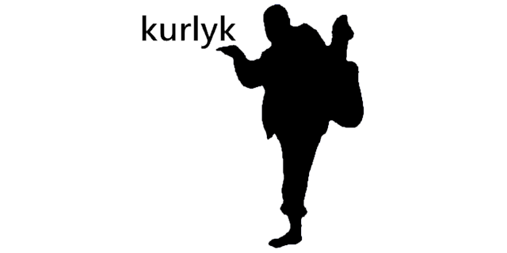

# Kurlyk


**C ++ library for easy curl work**

## Описание


> ## Братишка, я тебе покушать принёс
>
> *Фраза из артхаусного фильма “Зелёный слоник”*

Что такое *kurlyk*? Да это же **еще одна библиотека** для более простой работы с [curl](https://curl.se/)! 
Если вас по тем или иным причинам не устроили библиотеки *easyhttp-cpp, curl_request, curlpp-async, curlwrapper, curl-Easy-cpp, curlpp11, easycurl, curl-cpp-wrapper...* 
То может быть, стоит попробовать эту?

## Использование

Чтобы сделать запрос, достаточно создать объект класса *kurlyk::Client* и
настроить все необходимое в *config* или через методы класса. 
Затем можно вызывать подходящий вам метод.

Самый основной метод, который подходит под все виды запросов - *request*.
Данный метод содержит все необходимые параметры для осуществления любого типа запроса, будь то *GET, POST, PUT, DELETE*.

Пример с GET запросом:

```cpp
std::cout << "Returns Origin IP, v1" << std::endl;
kurlyk::Client client("https://httpbin.org");
client.config.sert_file = "curl-ca-bundle.crt";
client.config.header = true;    // debug
client.config.verbose = true;   // debug
long err = client.request(
		"GET",              // method
		"/ip",              // path
		kurlyk::Arguments(),// args
		std::string(),      // content
		kurlyk::Headers(),  // headers
		[&](const kurlyk::Output &output) { // lambda

	std::cout << "response: " << std::endl << output.response << std::endl;
	std::cout << "curl code: " << output.curl_code << std::endl;
	std::cout << "response code: " << output.response_code << std::endl;
});
std::cout << "error curl code: " << err << std::endl << std::endl;
```

Для более простого обращения с запросами есть упрощенные методы

```cpp
std::cout << "Returns Origin IP, v2" << std::endl;
kurlyk::Client client("https://httpbin.org", true);
std::cout << "response:" << std::endl << client.get("/ip", kurlyk::Headers()) << std::endl;
std::cout << "response:" << std::endl << client.get("/ip") << std::endl;
```

### Максимум возможностей


Почти все варианты настроек можно увидеть в примере ниже:

```cpp
std::cout << "Returns GET data, v2" << std::endl;
kurlyk::Client client("https://httpbin.org");

client.config.sert_file = "curl-ca-bundle.crt";
client.config.user_agent = "Agent 007";
client.config.timeout = 5;

// настроим прокси
client.config.proxy_ip = "89.212.193.253";
client.config.proxy_port = 65238;
client.config.proxy_username = "user_admin";
client.config.proxy_password = "12345";
//client.config.proxy_type = kurlyk::ProxyTypes::HTTPS;
client.config.proxy_type = kurlyk::ProxyTypes::SOCKS5;
		
// установим строку с cookie
// client.add_cookie("author", "green-elephant"); - еще один вариант установки cookie
client.config.cookie = "elephant=Green";
// включим использование cookie
client.config.use_cookie = true;
// отключим использование файла cookie, хранение данных cookie будет в ОЗУ
// вызвать clear_cookie_buffer() если данные ОЗУ надо очистить перед использованием
client.config.use_cookie_file = false;
// имя файла cookie для curl, в данном примере не будет задействовоан
// вызвать client.clear_cookie_file() если данные файла надо очистить перед использованием
client.config.cookie_file = "simple-cookie.txt";

// прочие настройки
client.config.auto_referer = true;
client.config.follow_location = true;
client.config.max_redirects = 10;

// укажем кодировку
client.config.use_accept_encoding = true;
client.config.use_brotli_encoding = true;
client.config.use_deflate_encoding = false;
client.config.use_gzip_encoding = false;
client.config.use_identity_encoding = false;

// включим режим отладки
client.config.header = true;    // debug
client.config.verbose = true;   // debug

// добавим заголовки
kurlyk::Headers headers;
headers.emplace("Heron", "kurlyk-kurlyk");
headers.emplace("Green", "elephant");

// добавим аргументы
kurlyk::Arguments arguments;
arguments.emplace("elephant", "green");

long err = client.request(
		"GET", // тип запроса
		"/get",
		arguments,
		headers,
		[&](const kurlyk::Output &output) {
	std::cout << "response: " << std::endl << output.response << std::endl;
	std::cout << "curl code: " << output.curl_code << std::endl;
	std::cout << "response code: " << output.response_code << std::endl;
});
std::cout << "curl code: " << err << std::endl << std::endl;
```

## Потокобезопасность

Следующие методы или объекты класса Client для настроек запроса являются **потокобезопасными**:

```cpp
clear_cookie_file()
clear_cookie_buffer()
add_cookie(const Cookie &cookie)
add_cookie(const std::string &name, const std::string &value)
```

Следующие методы или объекты класса *Client* для настроек запроса **не являются потокобезопасными**:

```cpp
Client.config
```

Можно делать асинхронные запросы следующим образом:

```cpp
kurlyk::Client client("https://httpbin.org");
client.config.sert_file = "curl-ca-bundle.crt";
client.config.header = false;
client.config.verbose = false;

client.use_multi_threaded = true;

for (int i = 0; i < 10; ++i) {
	client.async_request("GET", "/ip", kurlyk::Arguments(), std::string(), kurlyk::Headers(),
			[i](const kurlyk::Output &output) {
		std::cout << "& <" << i << ">" << std::endl;
		std::cout << "response: " << std::endl;
		std::cout << output.response << std::endl;
		std::cout << "err_code: " << output.curl_code << std::endl;
		std::cout << "response_code: " << output.response_code << std::endl;
		std::cout << "----------------------------------------" << std::endl;
	});
}

std::thread t1([&client](){
	while(!false) {
		client.loop();
	}
});
t1.detach();

std::thread t2([&client](){
	for (int i = 0; i < 10; ++i) {
		client.async_request("GET", "/ip", kurlyk::Arguments(), std::string(), kurlyk::Headers(),
				[i](const kurlyk::Output &output) {
			std::cout << "- <" << i << ">" << std::endl;
			std::cout << "response: " << std::endl;
			std::cout << output.response << std::endl;
			std::cout << "err_code: " << output.curl_code << std::endl;
			std::cout << "response_code: " << output.response_code << std::endl;
			std::cout << "----------------------------------------" << std::endl;
		});
	}
});

t2.join();
```

## Дополнительные возможности

**защищенные файлы cookie**

Библиотека *kurlyk* может сохранять *Cookie* в зашифрованном виде, в отличии от стандартного *движка Cookie* библиотеки *curl*.
Для шифрования используется агоритм *AES*.

Чтобы добавить поддержку защищенных файлов cookie, укажите следующий *define*:

```cpp
#define KYRLUK_AES_SUPPORT
```

Класс *Client* получит дополнительные методы:

```cpp
bool clear_protected_file_cookie()
bool save_protected_file_cookie()
bool open_protected_file_cookie()
```

Также класс *Client* пополнится двумя настройками:

```cpp
kurlyk::Client client("https://example.org"); // просто пример

//...

client.config.key; // std::array<uint8_t, 32>
client.config.cookie_protected_file; // std::string
```

Для использования защищенных файлов cookie используйте вышеперечисленные методы и настройки. 
Не забудьте установить также следующие параметры:

```cpp
kurlyk::Client client("https://example.org"); // просто пример

//...

client.config.use_cookie = true;
client.config.use_cookie_file = false;
```
*Внимание! Данный вариант использования Cookie не работает с переадресацией!*

**cookie без файлов**

Библиотека *kurlyk* может сохранять *Cookie* без использования файлов, внутри специального буфера класса *Client*.
Не забудьте установить следующие параметры, чтобы использовать *Cookie* без использования файлов:

```cpp
kurlyk::Client client("https://example.org"); // просто пример

//...

client.config.use_cookie = true;
client.config.use_cookie_file = false;
```

*Внимание! Данный вариант использования Cookie не работает с переадресацией!*

## Сборка

Библиотека *kurlyk* разработана как *header-only*. Однако, для ее работы нужен **curl** и **OpenSSL**.
Если вы компилируете при помощи *mingw*, я рекомендую использовать готовые сборки **curl** и **OpenSSL**.
Сборки данных библиотек, на которых тестировалась работа *kurlyk*, находятся как субмодули в папке *lib*.

Первоисточник сборок:

* https://slproweb.com/products/Win32OpenSSL.html

* https://curl.se/windows/

Одним словом, **kurlyk!**



