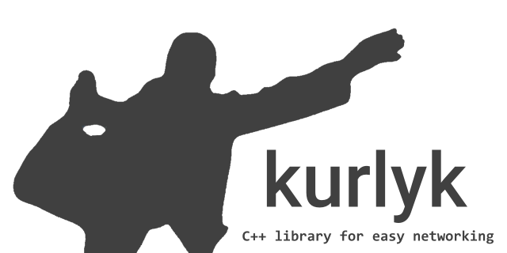
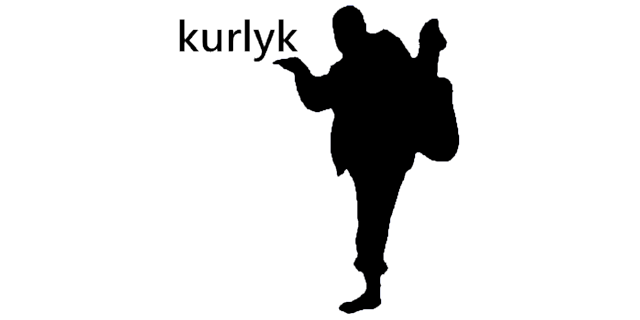

# kurlyk


**C++ library for easy networking**

[README на русском](README-RU.md)

## Description

**kurlyk** is another library implementing HTTP and WebSocket clients for C++. Built as a wrapper around `curl` and `Simple-WebSocket-Server`, it provides a simplified interface for working with HTTP and WebSocket connections in C++ applications. The library supports asynchronous HTTP requests with rate limiting and retry mechanisms, as well as WebSocket connectivity.

If you’re not satisfied with other libraries like *easyhttp-cpp, curl_request, curlpp-async, curlwrapper, curl-Easy-cpp, curlpp11, easycurl, curl-cpp-wrapper…* then you might want to give `kurlyk` a try.

### Features

- Asynchronous HTTP and WebSocket requests
- Rate limiting support to prevent network overload
- Automatic reconnection with customizable parameters
- Simple and intuitive class-based interface
- Designed for use in small applications
- Supports C++11

## Usage Examples

Examples are located in the `examples` folder. Below are some basic usage examples.

### WebSocket Client Example

This example shows how to connect to a WebSocket server, send a message, and handle various events (connection open, message received, connection close, and error):

```cpp
#include <kurlyk.hpp>
#include <thread>
#include <chrono>

int main() {
    // Create a WebSocket client with the specified server URL
    kurlyk::WebSocketClient client("wss://echo-websocket.fly.dev/");

    // Set up WebSocket event handler
    client.on_event([](std::unique_ptr<kurlyk::WebSocketEventData> event) {
        switch (event->event_type) {
            case kurlyk::WebSocketEventType::WS_OPEN:
                KURLYK_PRINT << "Connection established" << std::endl;

                // Output HTTP version and headers
                KURLYK_PRINT << "HTTP Version: " << event->sender->get_http_version() << std::endl;
                KURLYK_PRINT << "Headers:" << std::endl;
                for (const auto& header : event->sender->get_headers()) {
                    KURLYK_PRINT << header.first << ": " << header.second << std::endl;
                }

                // Send a message
                event->sender->send_message("Hello, WebSocket!", 0, [](const std::error_code& ec) {
                    if (ec) {
                        KURLYK_PRINT << "Failed to send message: " << ec.message() << std::endl;
                    } else {
                        KURLYK_PRINT << "Message sent successfully" << std::endl;
                    }
                });
                break;

            case kurlyk::WebSocketEventType::WS_MESSAGE:
                KURLYK_PRINT << "Message received: " << event->message << std::endl;

                // Send a response
                event->sender->send_message("Hello again!");
                break;

            case kurlyk::WebSocketEventType::WS_CLOSE:
                KURLYK_PRINT << "Connection closed: " << event->message
                             << "; Status code: " << event->status_code << std::endl;
                break;

            case kurlyk::WebSocketEventType::WS_ERROR:
                KURLYK_PRINT << "Error: " << event->error_code.message() << std::endl;
                break;
        };
    });

    // Connect to the server
    KURLYK_PRINT << "Connecting..." << std::endl;
    client.connect();

    // Wait to receive messages
    std::this_thread::sleep_for(std::chrono::seconds(10));
    
    // Send a final message through the client class
    client.send_message("Goodbye!");

    // Disconnect from the server
    KURLYK_PRINT << "Disconnecting..." << std::endl;
    client.disconnect_and_wait();

    KURLYK_PRINT << "End of execution" << std::endl;
    return 0;
}
```

### HTTP Client Examples

These examples demonstrate how to use the kurlyk HTTP client to perform different requests and handle responses.

#### Example 1: Performing GET and POST requests with response handlers

```cpp
#include <kurlyk.hpp>
#include <iostream>

// Function to print response information
void print_response(const kurlyk::HttpResponsePtr& response) {
    KURLYK_PRINT
        << "ready: " << response->ready << std::endl
        << "response: " << response->content << std::endl
        << "error_code: " << response->error_code << std::endl
        << "status_code: " << response->status_code << std::endl
        << "----------------------------------------" << std::endl;
}

int main() {
    kurlyk::init(true);
    kurlyk::HttpClient client("https://httpbin.org");

    // Sending a GET request with a response handler
    client.get("/ip", kurlyk::QueryParams(), kurlyk::Headers(),
        [](const kurlyk::HttpResponsePtr response) {
            print_response(response);
        });

    // Sending a POST request with a response handler
    client.post("/post", kurlyk::QueryParams(), {{"Content-Type", "application/json"}}, "{\"text\":\"Sample POST Content\"}",
        [](const kurlyk::HttpResponsePtr response) {
            print_response(response);
        });

    kurlyk::deinit();
    return 0;
}
```

#### Example 2: Performing GET and POST requests with std::future

```cpp
#include <kurlyk.hpp>
#include <iostream>

int main() {
    kurlyk::init(true);
    kurlyk::HttpClient client("https://httpbin.org");

    // Asynchronous GET request
    auto future_response = client.get("/get", kurlyk::QueryParams{{"param", "value"}}, kurlyk::Headers());
    kurlyk::HttpResponsePtr response = future_response.get();
    print_response(response);

    // Asynchronous POST request
    auto future_post = client.post("/post", kurlyk::QueryParams(), kurlyk::Headers{{"Header", "Value"}}, "Async POST Content");
    kurlyk::HttpResponsePtr post_response = future_post.get();
    print_response(post_response);

    kurlyk::deinit();
    return 0;
}
```

#### Example 3: Setting up a proxy and sending a GET request

```cpp
#include <kurlyk.hpp>
#include <iostream>

int main() {
    kurlyk::init(true);
    kurlyk::HttpClient client("https://httpbin.org");

    // Set proxy parameters
    client.set_proxy("127.0.0.1", 8080, "username", "password", kurlyk::ProxyType::HTTP);

    // Sending GET request through proxy
    client.get("/ip", kurlyk::QueryParams(), kurlyk::Headers(),
        [](const kurlyk::HttpResponsePtr response) {
            print_response(response);
        });

    kurlyk::deinit();
    return 0;
}
```

#### Example 4: GET request using the http_get function

```cpp
#include <kurlyk.hpp>
#include <iostream>

int main() {
    kurlyk::init(true);

    // Asynchronous GET request using the standalone function
    uint64_t request_id = kurlyk::http_get("https://httpbin.org/ip", kurlyk::QueryParams(), kurlyk::Headers(),
        [](const kurlyk::HttpResponsePtr response) {
            print_response(response);
        });

    std::system("pause");
    kurlyk::cancel_request_by_id(request_id).wait();
    kurlyk::deinit();
    return 0;
}
```

## Dependencies and Installation
To work with the **kurlyk** library in MinGW, you will need the following dependencies:

1. For WebSocket:

    - [Simple-WebSocket-Server](https://gitlab.com/eidheim/Simple-WebSocket-Server)
    - Boost.Asio or [standalone Asio](https://github.com/chriskohlhoff/asio/tree/master)
    - [OpenSSL](https://slproweb.com/products/Win32OpenSSL.html) (*LTS версия Win64 OpenSSL v3.0.15*)
    
2. For HTTP:
    - [libcurl](https://curl.se/windows/)

All dependencies are also included as submodules in the `libs` folder.

### OpenSSL Setup

1. Add OpenSSL paths to the project (example for version *3.4.0*):

```
OpenSSL-Win64/include
OpenSSL-Win64/lib/VC/x64/MD
OpenSSL-Win64/bin
```

2. Link OpenSSL libraries from `lib/VC/x64/MD`:

```
capi.lib
dasync.lib
libcrypto.lib
libssl.lib
openssl.lib
ossltest.lib
padlock.lib
```

### Standalone Asio Setup

1. Add the path to Asio in your project (example for [Asio repository](https://github.com/chriskohlhoff/asio/tree/master)):

```
asio/asio/include
```

2. Set the macro `ASIO_STANDALONE` in your project settings or before including `kurlyk.hpp`:

```cpp
#define ASIO_STANDALONE
#include <kurlyk.hpp>
```

> **Note:** For Boost.Asio, you do not need to define the `ASIO_STANDALONE` macro.

### curl Setup

1. Add the paths for `curl` in your project (example for version *8.11.0*):

```
curl-8.11.0_1-win64-mingw/bin
curl-8.11.0_1-win64-mingw/include
curl-8.11.0_1-win64-mingw/lib
```

2. Link the `curl` libraries from the `lib` folder:

```
libcurl.a
libcurl.dll.a
```

### Simple-WebSocket-Server Setup

Add the path to the Simple-WebSocket-Server headers in your project:

```
Simple-WebSocket-Server
```

### Linking Other Dependencies

Additionally, link the following libraries in the linker:

```
ws2_32
wsock32
crypt32
```
    
### Adding kurlyk

Add the path to the kurlyk header files:

```
kurlyk/include
```

**kurlyk** is a header-only library, so you only need to include it with `#include <kurlyk.hpp>` to start using it.

## Documentation
In progress.

## License
This library is distributed under the MIT license. See the [LICENSE](https://github.com/NewYaroslav/log-it-cpp/blob/main/LICENSE) file in the repository for details.

## Support
If you have questions or issues using the library, you can refer to the documentation or ask a question in the GitHub Issues section.

In short, **kurlyk!**



