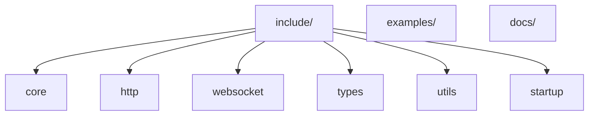
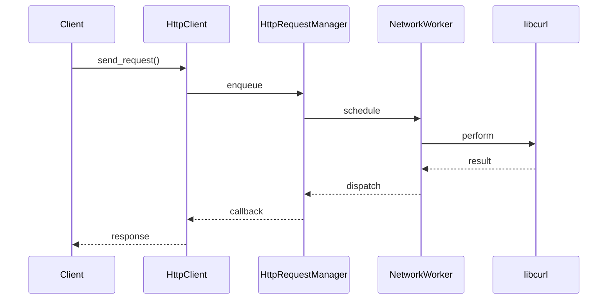

# Architecture Guide

## System Map

The library is split into modules under `include/kurlyk` providing core infrastructure, HTTP and WebSocket clients, shared types, utilities, and optional startup helpers. Example programs live in `examples/`, and additional documentation resides in `docs/`.

## Core Workflow

This flow illustrates how an HTTP request moves from the caller through `HttpClient`, into `HttpRequestManager`, and finally to `NetworkWorker`, which delegates to `libcurl`.

## Architectural Patterns & Invariants

- Header-only design keeps all functionality in headers; no compiled library.
- `NetworkWorker` processes tasks on a single background thread; avoid blocking it.
- HTTP and WebSocket managers apply rate limits and retries consistently.
- Error dispatch flows through `NetworkWorker`; maintain exception safety.
- Public APIs rely on value semantics and RAII.
- Configuration is compile-time via macros with minimal defaults.
- Code remains portable across C++11/17 compilers and network stacks.
