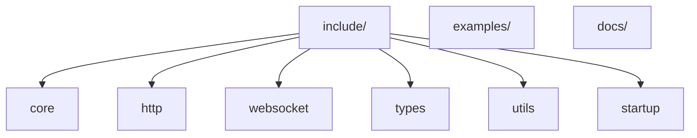
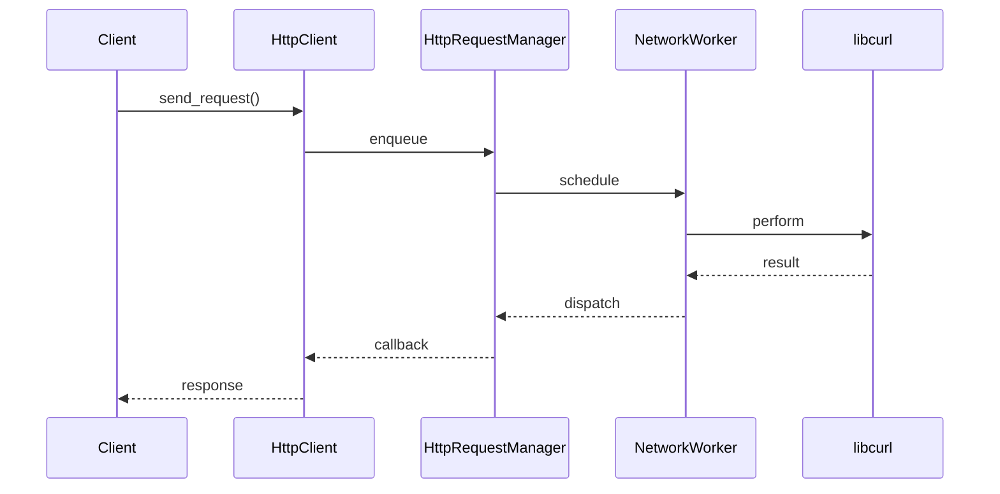

# Architecture Guide

## System Map

```mermaid
graph TD
    include["include/"] --> core["core"]
    include --> http["http"]
    include --> websocket["websocket"]
    include --> types["types"]
    include --> utils["utils"]
    include --> startup["startup"]
    examples["examples/"]
    docs["docs/"]
```

The library is split into modules under `include/kurlyk` providing core infrastructure, HTTP and WebSocket clients, shared types, utilities, and optional startup helpers. Example programs live in `examples/`, and additional documentation resides in `docs/`.

## Core Workflow

```mermaid
sequenceDiagram
    participant Client
    participant HttpClient
    participant Manager as HttpRequestManager
    participant Worker as NetworkWorker
    participant Curl as libcurl
    Client->>HttpClient: send_request()
    HttpClient->>Manager: enqueue
    Manager->>Worker: schedule
    Worker->>Curl: perform
    Curl-->>Worker: result
    Worker-->>Manager: dispatch
    Manager-->>HttpClient: callback
    HttpClient-->>Client: response
```

This flow illustrates how an HTTP request moves from the caller through `HttpClient`, into `HttpRequestManager`, and finally to `NetworkWorker`, which delegates to `libcurl`.

## Architectural Patterns & Invariants

- Header-only design keeps all functionality in headers; no compiled library.
- `NetworkWorker` processes tasks on a single background thread; avoid blocking it.
- HTTP and WebSocket managers apply rate limits and retries consistently.
- Error dispatch flows through `NetworkWorker`; maintain exception safety.
- Public APIs rely on value semantics and RAII.
- `WebSocketClient` acts as a facade over a backend selected at compile time, while event payloads keep the stable `IWebSocketSender` abstraction for follow-up actions.
- Configuration is compile-time via macros with minimal defaults.
- Code remains portable across C++11/17 compilers and network stacks.

## Flow Control

Kurlyk now uses two separate control layers:

- Rate limiting controls when work is allowed to leave the library and hit the backend.
- Backpressure controls whether new work is admitted into selected queues.

HTTP rate limits are referenced through `HttpRateLimitHandlePtr`. Creating a limit stores a manager-owned handle, each request copies the handle it needs, and `remove_limit(...)` releases only the manager-owned reference. If pending, active, or retrying requests still hold copies, the physical limit data stays alive until those requests are destroyed. Code that depends on lifetime semantics should pass handles, not naked IDs; ID-based APIs are legacy lookup compatibility.

### Sequential Rate Limits

A rate limit can optionally operate in **sequential** mode. In this mode a limit enforces ordering in addition to the usual `count / period` pacing:

> While any request (including all of its retries) is still in-flight for a sequential limit, no *other* request sharing that limit may start. Retries of the *same* request are allowed.

This is implemented through an **in-flight token** mechanism rather than a global mutex, so that a long request (or one with multiple retries) does not stall unrelated requests that use a different limit.

#### Why an internal in-flight token instead of the public `request_id`?

`HttpRequest::request_id` is public API and may be set by the caller, reused, or left at `0`. Using it as the internal sequential lock key would create subtle bugs when two unrelated requests happen to share the same `request_id`. Instead, `HttpRequestManager` assigns a private monotonic `in_flight_token` to every `HttpRequestContext` when it is submitted. The token travels with the context through the entire lifecycle (`pending -> active -> failed -> pending -> ... -> done`) and is never exposed to callers.

#### Why `std::function<void()>` in `HttpRequestContext` instead of a new RAII lease object?

A dedicated RAII lease class would need to be stored in `HttpRequest`, but `HttpClient::make_request()` copies its template `HttpRequest` from `m_request`. A `unique_ptr` inside `HttpRequest` would not survive that copy, and a `shared_ptr` would require synchronised creation in multiple code paths. The `std::function` in `HttpRequestContext` is simpler: the context is already moved between queues, the callback is set exactly once when a sequential limit is acquired, and it is invoked exactly once by `HttpRequestContext::complete()` when the request definitively finishes.

#### Why `complete()` is idempotent and thread-safe

A request may finish through several paths: normal completion, exhaustion of retries, explicit cancellation, or destruction of the `HttpRequestHandler` before any of the above. More than one path can trigger in edge cases (for example, an active request is cancelled and the handler is destroyed shortly after). `complete()` uses `std::atomic<bool>` with `compare_exchange_strong` so that the release callback is invoked at most once, preventing a double-release of the sequential lock.

#### Why `allow_request()` is atomic

A single request may reference both a `general_limit` and a `specific_limit`. `allow_request()` must check *both* limits and update *both* of them, or update *neither*. If the first limit passed but the second did not, the request is rejected and no state change is left behind. This prevents a phantom sequential lock that would block the next request even though the current one never started.

#### Retry behaviour

When a request fails and still has retry attempts left, the handler returns `false` from `handle_curl_message()` and moves the context back to the `m_failed_requests` queue. `complete()` is **not** called, so the in-flight token stays in the sequential set. After the retry delay the context is promoted back to `m_pending_requests`, and `allow_request()` sees the same token already registered — the retry is allowed. Only when the request finally succeeds or exhausts its retries does `complete()` fire and release the lock.

#### Legacy API compatibility

Legacy `allow_request(long, long)` and the handle-based overload without an explicit token both pass `token = 0`. A sequential limit with `token == 0` is treated as non-sequential for that call. This means old code that does not know about sequential mode continues to work unchanged; the sequential guarantee is only enforced for requests created through the new `HttpRequestManager` path where a token is generated.

Current bounded admission points:

- HTTP bounds only the global pending request queue.
- WebSocket bounds only the per-client outbound send queue.

Current non-bounded areas:

- `core::NetworkWorker` task queue
- WebSocket FSM queue
- WebSocket stored event queue
- WebSocket send callback queue

This means queue limits are a memory/admission safety feature, not a full QoS system, and they should not be described as replacing existing rate limiting behavior.

## HTTP Cancellation

HTTP cancellation has two scopes. `request_id` targets one concrete request, while `group_id` targets related requests. `HttpClient` assigns a generated `group_id` to every request created from that client, so `HttpClient::cancel_requests()` is implemented as group cancellation for that client. Standalone and manually constructed requests can choose their own `group_id` and use `cancel_requests_by_group_id(...)` directly.

## Lifecycle

Automatic startup registers managers and starts `NetworkWorker` before application code uses the public API. Manual lifecycle disables auto-init with `KURLYK_AUTO_INIT 0`: `init(true)` starts asynchronous processing, while `init(false)` leaves processing to application calls to `process()`. In both modes `deinit()` is the explicit cleanup point before shutdown.
