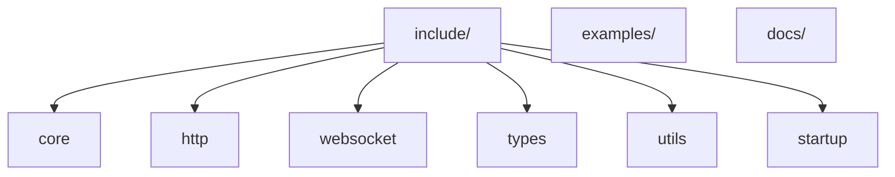
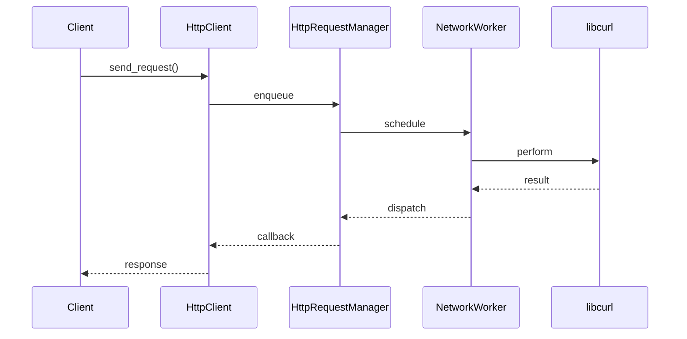

# Architecture Guide

## System Map

```mermaid
graph TD
    include["include/"] --> core["core"]
    include --> http["http"]
    include --> websocket["websocket"]
    include --> types["types"]
    include --> utils["utils"]
    include --> startup["startup"]
    examples["examples/"]
    docs["docs/"]
```

The library is split into modules under `include/kurlyk` providing core infrastructure, HTTP and WebSocket clients, shared types, utilities, and optional startup helpers. Example programs live in `examples/`, and additional documentation resides in `docs/`.

## Core Workflow

```mermaid
sequenceDiagram
    participant Client
    participant HttpClient
    participant Manager as HttpRequestManager
    participant Worker as NetworkWorker
    participant Curl as libcurl
    Client->>HttpClient: send_request()
    HttpClient->>Manager: enqueue
    Manager->>Worker: schedule
    Worker->>Curl: perform
    Curl-->>Worker: result
    Worker-->>Manager: dispatch
    Manager-->>HttpClient: callback
    HttpClient-->>Client: response
```

This flow illustrates how an HTTP request moves from the caller through `HttpClient`, into `HttpRequestManager`, and finally to `NetworkWorker`, which delegates to `libcurl`.

## Architectural Patterns & Invariants

- Header-only design keeps all functionality in headers; no compiled library.
- `NetworkWorker` processes tasks on a single background thread; avoid blocking it.
- HTTP and WebSocket managers apply rate limits and retries consistently.
- Error dispatch flows through `NetworkWorker`; maintain exception safety.
- Public APIs rely on value semantics and RAII.
- `WebSocketClient` acts as a facade over a backend selected at compile time, while event payloads keep the stable `IWebSocketSender` abstraction for follow-up actions.
- Configuration is compile-time via macros with minimal defaults.
- Code remains portable across C++11/17 compilers and network stacks.

## Flow Control

Kurlyk now uses two separate control layers:

- Rate limiting controls when work is allowed to leave the library and hit the backend.
- Backpressure controls whether new work is admitted into selected queues.

Current bounded admission points:

- HTTP bounds only the global pending request queue.
- WebSocket bounds only the per-client outbound send queue.

Current non-bounded areas:

- `core::NetworkWorker` task queue
- WebSocket FSM queue
- WebSocket stored event queue
- WebSocket send callback queue

This means queue limits are a memory/admission safety feature, not a full QoS system, and they should not be described as replacing existing rate limiting behavior.
